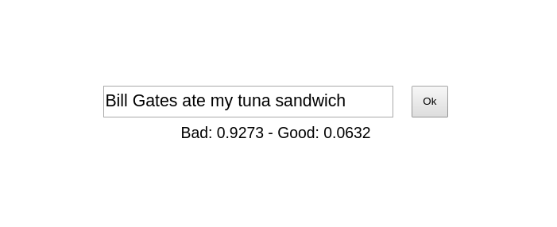
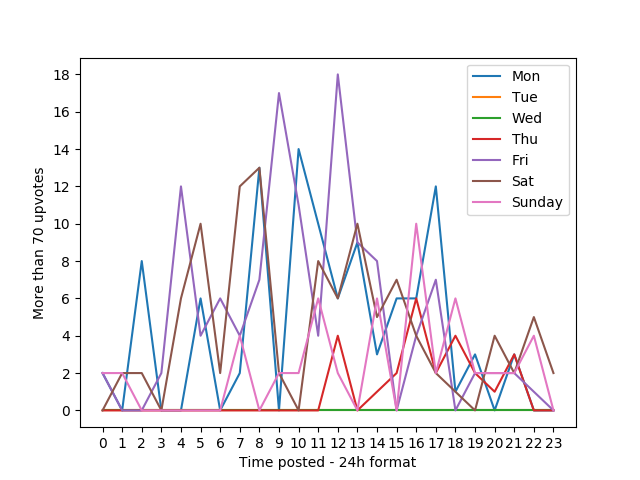

# HN Titlenator

A neural network to predict whether your HN post will get up votes by the title.

Test your title [here](https://victorribeiro.com/hntitlenator)

## About

A project about [neural networks](https://en.wikipedia.org/wiki/Neural_network) and [NLP](https://en.wikipedia.org/wiki/Natural_language_processing). Can a neural network predict how many up votes your HN post will have?

## Motivation

Ever since I joined the hackernews community I've been wondering how one could get more attention when sharing a story. One of the things I noticed is the timming. The day of the week and the hour of the day you post your story seems to affect how many up votes your story will get.

In order to check that, I got 1256 stories from [HN API](https://github.com/HackerNews/API). I then took the mean of the score of those stories and found a value of 70 up votes. Then I plotted a graph showing the day of the week and hour of the day those stories, who got more than 70 up votes, were posted.

As you can see, Friday noon (UTC-3 Brasilia) seems to be the best day to post your storie, since 18 stories posted that time had more than 70 upvotes (keep in mind that I only had access to 1256 stories, it's a very small sample compared to all the post HN must have every day).

Is that all? It's the time of the day and day of the week the only one responsible for getting up votes? Well, I decied to train a neural network with the words used on the titles and classify the title as *good* if they had more than 70 up votes and *bad* if they didn't.

## Neural Network

In order to train the neural network, I counted how many words were used in each title. The longest title had 17 words and the mean of all titles were 9 words. So, I model my neural network to recive 20 words as input. Titles with less then 20 words on them were padded with zeros.

I then turn each word into a value with the help of a [dictionary](https://github.com/dwyl/english-words/blob/master/words_alpha.txt).

I then created a simple web app where people could input their title and see how the neural network classifies it.

## Limitations

This project is far from credible. All the things I did were to satisfy my own curiosity. With that being said, the bigger limitation I can see is that I only had access to a few stories. I also cannot validated the neural network prediction, cause in order for me to do that, I would have to write a content, come up with a title and then post it choosing words that triggers a good value on the neural network and post that history on a Friday noon, to see if my story succeed.

## Source code

I tried to keep the code as clean as possible, but keep in mind that I did the whole experiment in one night. I tried to separate each step in it's own python script: get_data.py, proccess_data.py, train.py, retrain.py, plot.py

